# FlowGuard

[](https://github.com/yoonjae26/FlowGuard/actions/workflows/ci.yml)
[](https://github.com/yoonjae26/FlowGuard/actions/workflows/codeql.yml)
[](LICENSE)

**Stop AI agents from leaking sensitive data through their tools, even after the data has been encoded, split up, or re-wrapped.**

An agent that can read your HR system and call an HTTP tool is one prompt injection away from posting salaries to a stranger's server. A regex scanner on outbound text catches `123-45-6791` but not `MTIzLTQ1LTY3OTE=`, and it has no idea that the value came out of your database. FlowGuard remembers *which values the agent has seen* and checks every outbound payload against them, looking through base64, hex, URL/HTML/unicode escapes, JSON wrapping, and pieces sent over several calls.

```
agent --> tool call --> [ FlowGuard ] --> ALLOW --> real tool
                             |
                             +--> BLOCK   (agent gets a generic refusal; details go to the audit log)
```

- **Policy as data.** Say which fields are sensitive and how sensitive each destination is allowed to see (`PUBLIC` < `INTERNAL` < `CONFIDENTIAL` < `SENSITIVE` < `HIGHLY_SENSITIVE`). Unknown destinations get `PUBLIC` only.
- **Framework-agnostic.** Wrap Python tool functions with decorators; `Toolbox.dispatch(name, args)` plugs into OpenAI, Anthropic, or any other tool-calling loop.
- **Safe to log.** The audit trail holds metadata and keyed fingerprints, never payloads or sensitive values.
- **Roll out gently.** `mode="monitor"` records what *would* be blocked without blocking anything.
- **Small.** Pure Python, one dependency (PyYAML), no network, no model calls, roughly 0.3 to 1.5 ms per check, flat from 4,000 to 156,000 tracked values.

> **Status: alpha (0.1).** The API may change. FlowGuard is one layer of defense, not a guarantee: read [what it does not stop](#what-flowguard-does-not-stop) and the [threat model](docs/THREAT_MODEL.md) before relying on it.

## See it work



The interesting line is the fragment one: the first half of a split secret is allowed, because on its own it is indistinguishable from harmless text. FlowGuard blocks the send that *completes* the disclosure -- see [limits](#what-flowguard-does-not-stop). Run it yourself:

```bash
python examples/quickstart.py
```

<details>
<summary>Full text output (same run, unabridged)</summary>

```console
$ python examples/quickstart.py
Legitimate use
  ALLOWED  name + department to partner       200 OK -> https://partner-sync.example.com/api
  ALLOWED  email to partner (CONFIDENTIAL ok) 200 OK -> https://partner-sync.example.com/api

The agent tries to leak the SSN
  BLOCKED  verbatim to partner                [FlowGuard] BLOCKED: sending this payload to 'partner-sync.example.com' violates the data-flow policy.
  BLOCKED  base64 to partner                  [FlowGuard] BLOCKED: sending this payload to 'partner-sync.example.com' violates the data-flow policy.
  BLOCKED  hex to unknown host                [FlowGuard] BLOCKED: sending this payload to 'collector.evil.test' violates the data-flow policy.
  ALLOWED  fragment 1 of 2 (piece by itself)  200 OK -> https://partner-sync.example.com/api
  BLOCKED  fragment 2 of 2 completes it       [FlowGuard] BLOCKED: sending this payload to 'partner-sync.example.com' violates the data-flow policy.
```

</details>

## Install

Requires Python 3.10+.

```bash
git clone https://github.com/yoonjae26/FlowGuard.git
cd FlowGuard
pip install .            # or: pip install -e ".[dev]" to hack on it
```

## Use it

### 1. Write a policy

```yaml
# policy.yaml
destinations:                        # highest level each destination may receive
  hr-db.corp.example: HIGHLY_SENSITIVE
  "*.corp.example": CONFIDENTIAL     # globs allowed; the most restrictive match wins
  partner-sync.example.com: CONFIDENTIAL
  # anything unlisted gets PUBLIC only

fields:                              # values under these keys are tainted when a tool returns them
  ssn: HIGHLY_SENSITIVE
  salary: SENSITIVE
  email: CONFIDENTIAL
```

Built-in detectors (SSNs, card numbers with Luhn check, AWS keys, API tokens, JWTs, private keys, emails) work on top of this, so a secret pasted into the prompt is caught by its format even if no tool ever returned it. Typos in a policy are errors, not silent gaps: `flowguard validate policy.yaml`. A complete example is in [examples/policy.yaml](examples/policy.yaml).

### 2. Mark sources and sinks

```python
from flowguard import Guard, Policy, FlowBlocked, hostname

guard = Guard(Policy.from_file("policy.yaml"))

@guard.source("hr.get_employee")             # everything this returns is tracked
def get_employee(emp_id: str) -> dict: ...

@guard.sink(lambda url: hostname(url))       # every argument is checked before the tool runs
def http_post(url: str, body: str) -> str: ...
```

A blocked call raises `FlowBlocked` and the tool never runs. Use `@guard.sink(..., on_block="return")` to return a refusal string instead. Async functions work too. No decorators available? Call `guard.observe(result, source=...)` and `guard.check(destination, payload)` yourself.

<details>
<summary><b>3. Plug into an LLM tool-calling loop</b></summary>

`Toolbox` is the same thing with a registry and a dispatcher, for when you would rather declare tools in one place (use it *instead of* the decorators above, not on top of them):

```python
from flowguard import Toolbox

tools = Toolbox(guard)

@tools.source
def get_employee(emp_id: str) -> dict: ...

@tools.sink(destination=lambda url: hostname(url))
def http_post(url: str, body: str) -> str: ...

# for each tool call the model makes (OpenAI, Anthropic, ...):
result = tools.dispatch(call.function.name, call.function.arguments)   # str, JSON args or dict
messages.append({"role": "tool", "tool_call_id": call.id, "content": result})
```

The model sees only `[FlowGuard] BLOCKED: sending this payload to 'x' violates the data-flow policy.` It is deliberately not told *what* was detected or *how*, so it cannot learn to rephrase around the check. The full explanation is in the audit log. A runnable OpenAI version is in [examples/openai_agent.py](examples/openai_agent.py) (written against the OpenAI API but not exercised in CI, which has no API key).

</details>

<details>
<summary><b>4. Roll out and audit</b></summary>

```python
guard = Guard(policy, mode="monitor", audit_path="flowguard.audit.jsonl")  # log only, block nothing
guard = Guard(policy, mode="enforce", audit_path="flowguard.audit.jsonl")  # default
```

Each line of the audit log looks like this (abridged; no payload, no value):

```json
{"allowed": false, "destination": "partner-sync.example.com", "destination_level": "CONFIDENTIAL",
 "findings": [{"fingerprint": "9c1e0a7b44d2", "fragmented": false, "kind": "field", "level": "HIGHLY_SENSITIVE",
               "origin": "hr.get_employee.ssn", "via": "base64"}],
 "tool": "http_post", "ts": "..."}
```

There is also a small CLI: `flowguard scan --policy policy.yaml --destination partner-sync.example.com --source record.json payload.txt` exits 1 if the payload would be blocked.

One `Guard` is one session: create one per agent run, or call `guard.reset()` between runs (`guard.reset_history()` keeps the tracked values but forgets what was sent).

For the riskiest sends, put a human in the loop even when policy alone would allow it:

```python
guard = Guard(
    policy,
    require_approval_above="HIGHLY_SENSITIVE",
    approve=lambda destination, payload, findings: ask_a_human(destination, findings),
)
```

`Policy.fields` only protects field names you've told it about; run for a while with `Guard(audit_unlabeled=True)` in monitor mode against real traffic, then check `guard.unlabeled_report()` for field names worth adding.

</details>

<details>
<summary><b>5. Tune to your risk</b></summary>

- `Policy(fragment_threshold={"HIGHLY_SENSITIVE": 0.4})` blocks a scattered value sooner for your most sensitive fields (default: 0.8 everywhere, unchanged from earlier releases).
- `Guard(cross_destination_fragments=True)` tracks fragmentation across every destination in one shared bucket instead of per destination, closing the "split across two destinations" gap below -- off by default, since it trades that for a real false-positive risk of its own.

See [docs/THREAT_MODEL.md](docs/THREAT_MODEL.md#tuning) for the full list of knobs.

</details>

## How it works

1. **Remember.** When a source returns data, FlowGuard walks it and records every value under a sensitive field or matching a sensitive pattern, with its level and origin.
2. **Decode.** Before checking an outbound payload it expands the text into every variant it knows how to produce (base64, hex, base32, URL/HTML/unicode escapes, rot13, reversal, ...), recursively.
3. **Match.** A tracked value found in any variant -- verbatim, decoded, hashed, or as a differently-written equal number -- is a finding.
4. **Piece it together.** Fragments sent consecutively or scattered across many sends are tracked per destination and add up.
5. **Decide.** Any finding above the destination's level blocks the call; only what actually left counts as disclosed.

**[docs/ARCHITECTURE.md](docs/ARCHITECTURE.md)** has the long version of all five, with real runnable traces: a coverage bitmask filling in fragment by fragment, the decoy-flood eviction defense actually resisting an attack, the digit-boundary trade-off in action.

## What FlowGuard does not stop

Read this before deploying: FlowGuard is a deny-list of known-sensitive values, not a guarantee. Two of the most important gaps --

- **Only what it has been told about.** Data in a field your policy does not label, and not matching a built-in pattern, is not protected. `Guard(audit_unlabeled=True)` helps find field names worth adding.
- **Only through guarded tools.** A shell, a browser, or any tool you did not wrap is invisible to FlowGuard. Pair it with network egress controls.

<details>
<summary>The rest of the list</summary>

- **Damage inside the secret.** Models retype long encoded strings imperfectly. FlowGuard recovers readable text from damaged base64/hex, but not a secret that the damage itself cuts through.
- **Destination helpers fail closed on purpose.** `hostname()`/`email_domains()` return "" (PUBLIC only) for any URL or address ambiguous enough that a real HTTP or mail client might read it differently, since ambiguity is a bypass waiting to happen, not something to guess through (see docs/THREAT_MODEL.md).
- **Ciphers, paraphrase, and derivations.** Spelling digits out in words, a Caesar shift other than rot13, XOR/encryption with a key, or leaking a *fact about* a value ("earns above 80k") get through. So do covert channels (payload length, timing, tool choice).
- **Small fragments are hard.** The first piece of a split secret is allowed (or gate it entirely with `require_approval_above`). Pieces under 4 characters only add up when consecutive in the same argument, and by default fragments sent to different destinations are not combined -- `cross_destination_fragments=True` closes that at the cost of its own false-positive risk.
- **Numbers collide.** A legitimate number that equals a tracked one (an invoice for exactly `$85,000` when someone earns `85000`) is blocked. Tune `min_value_length` or label fewer numeric fields.
- **It is not a substitute for** least-privilege credentials, or prompt-injection defenses. It limits the damage when those fail; pair it with `require_approval_above` for actions that need a person's sign-off regardless.

The full list, with the reasoning, is in [docs/THREAT_MODEL.md](docs/THREAT_MODEL.md) and each item is pinned by a test in [tests/test_known_limitations.py](tests/test_known_limitations.py).

</details>

## Evidence

Everything below uses **synthetic data** (no real people or secrets), reproducible from a script, with the two live-LLM rows backed by a committed transcript of every run.

| Evidence | Result |
|---|---|
| Benchmark vs. a plain regex DLP scanner ([BENCHMARK.md](docs/BENCHMARK.md)) | **100%** stopped on 27 covered techniques (vs. 14% for regex-DLP); 0% false positives on 1,400 ordinary sends |
| Live LLM agent, `gpt-4o-mini`, baseline ([LLM_EVAL.md](docs/LLM_EVAL.md)) | Unprotected: 49/50 attack/injection runs leaked. Enforced: **0/50** |
| Live LLM agent, white-box adaptive attacker, given the mechanism itself ([LLM_EVAL.md](docs/LLM_EVAL.md#adaptive-attacker-evaluation)) | **0/24** leaked, run twice independently |
| Mutation testing on the matching core ([MUTATION_TESTING.md](docs/MUTATION_TESTING.md)) | 71% of 893 mutants killed; 4 real test gaps found this way, fixed |
| Cost ([evals/scaling.py](evals/scaling.py)) | `check()` stays ~1.3 ms whether 4,000 or 156,000 values are tracked |

Full methodology, every caveat, and the research this grew out of (a study of how field-name-based labelling fails): **[docs/ARCHITECTURE.md#benchmarks-the-evidence-in-one-place](docs/ARCHITECTURE.md#benchmarks-the-evidence-in-one-place)**.

## Layout

| Path | What |
|---|---|
| [src/flowguard/](src/flowguard/) | The library |
| [tests/](tests/) | 330+ tests, including robustness and the known-gaps suite |
| [evals/](evals/) | Benchmark, scaling measurement, live-LLM evaluation (with transcripts) |
| [examples/](examples/) | Offline quickstart, OpenAI loop, sample policy |
| [docs/](docs/) | [Architecture](docs/ARCHITECTURE.md), [threat model](docs/THREAT_MODEL.md), [LLM evaluation](docs/LLM_EVAL.md), [benchmark](docs/BENCHMARK.md), [mutation testing](docs/MUTATION_TESTING.md) |
| [research/](research/) | The original research prototype and experiments (frozen; not the library) |

## Development

```bash
pip install -e ".[dev]"
ruff check src tests evals examples
mypy src/flowguard
pytest
```

CI runs this on Linux (Python 3.10-3.13) plus macOS and Windows (3.12); [docs/MUTATION_TESTING.md](docs/MUTATION_TESTING.md) checks that the coverage numbers above mean what they claim.

See [CONTRIBUTING.md](CONTRIBUTING.md). Found a bypass? See [SECURITY.md](SECURITY.md).

## License

Apache-2.0. See [LICENSE](LICENSE).
